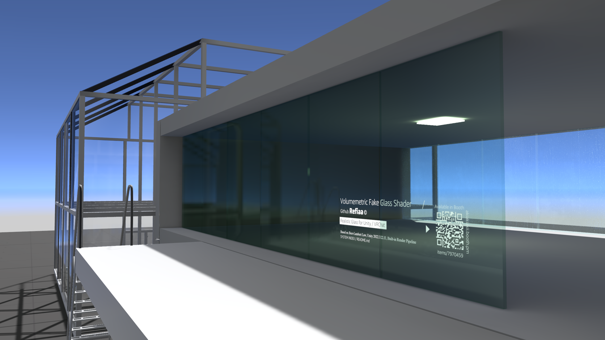
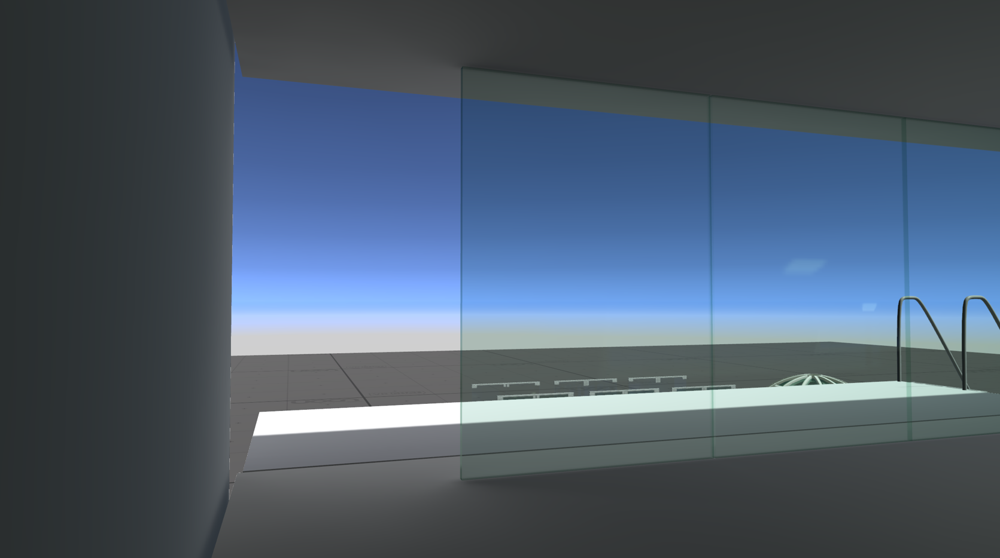
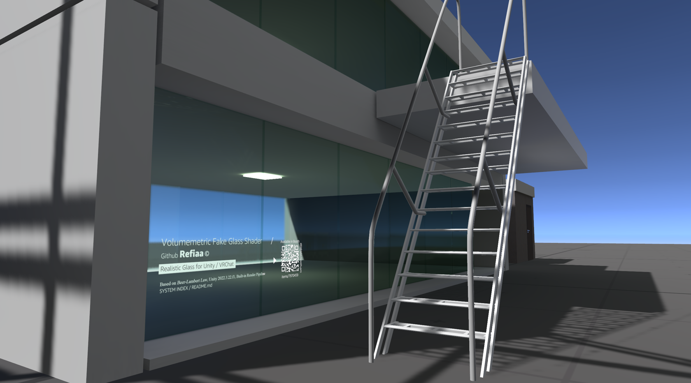
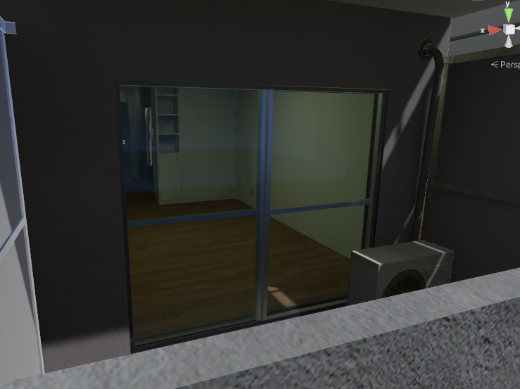

# Realistic Volumetric Glass Shader (Unity BRP)

## Introduction

A physically-based glass shader designed for the **Unity Built-in Render Pipeline (BRP)** and **VRChat** environments.

This shader applies the **Beer-Lambert Law** to simulate physical light absorption based on the thickness of the glass. This achieves a realistic glass material where thin areas appear transparent, while thicker areas appear denser and darker.

The shader has been verified to work in **Unity 2022.3.22f1, 2022.3.22f2, 2022.3.6f1** and **VRChat**.

## Key Features

- **Thickness-based absorption:** calculates the **distance (thickness)** light travels through the glass and applies exponential (Beer-Lambert) color absorption. Thickness comes from baked mesh data when available (see *Mesh Baking*), otherwise from a view-angle estimate.
- **Physical refraction:** traces the view ray through the glass with Snell's law. Choose *Thin Pane* (sheet glass: only the physical lateral shift) or *Solid* (lens-like bodies) in **Refraction Model**.
- **Dispersion:** red and blue refract with their own index derived from the **Abbe Number**, so color fringes appear only where light is actually bent.
- **Two-surface Fresnel:** front and back surface reflections with absorption between them; box-projected reflection probes are supported.
- **Internal Scattering (optional):** ambient light scattered inside long glass paths, giving cut edges their green glow.
- Rain (droplets / ripples) and roughness-driven refraction blur.

## Shaders

| Shader | Screen copies (GrabPass) | Use when |
|---|---|---|
| `refiaa/glass` | one per visible glass object | a few glass objects, or exact glass-behind-glass refraction matters |
| `refiaa/glass (Shared Grab)` | **one per frame** for all objects using it | many glass objects (recommended for scenes) |

Both use the same properties; switching the shader on a material keeps its values.
With *Shared Grab*, glass seen through other glass is still visible, but without the front glass's refraction offset. It requires an **HDR camera** (the default on PC and in VRChat).

## Mesh Baking

Select the glass objects and run **Tools > Glass Shader > Bake Selected Mesh Edge Data**. Baked copies are saved to `MeshEdgeBaked/` and assigned to the renderers.

- Bakes mesh-edge data (for *Mesh Edge Highlight* / edge distortion) and the **local glass thickness** (pane faces get their thickness, cut edges their width).
- Uses UV channels 3, 4 and 5 (existing data in them is replaced). Blend shapes are kept.
- Unbaked meshes still work and use **Fallback Thickness**.

## Gallery

  <table>
    <tr>
      <td align="center">
        <video src="https://github.com/user-attachments/assets/d4fabdca-d540-4030-88b0-dbd326be6298" width="100%" controls autoplay loop muted></video>
      </td>
    </tr>
    <tr>
      <td align="center">
        <video src="https://github.com/user-attachments/assets/dfd13087-c7e7-404f-8969-8435d52d4d2d" width="100%" controls autoplay loop muted></video>
      </td>
    </tr>
    <tr>
      <td align="center">
        
      </td>
    </tr>
  </table>

## Compatibility

This shader has been tested and verified in the following environments:

* **Unity Version:**
  * 2022.3.22f1 (Verified)
  * 2022.3.22f2 (Verified)
  * 2022.3.6f1 (Verified)

* **Platform:**
  * VRChat (PC). GrabPass is not supported on Quest/Android.
 
---

